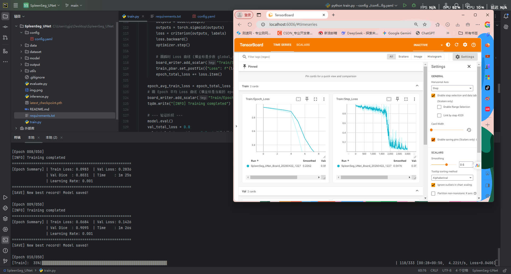
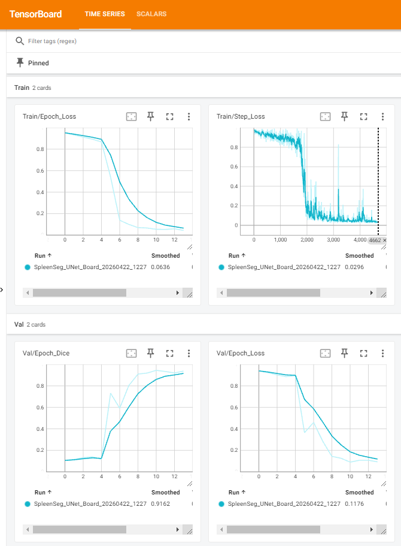
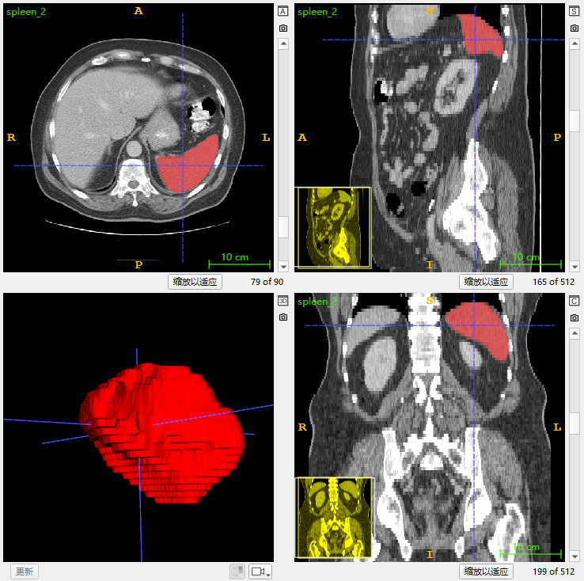

# 基于 2D U-Net的脾脏分割（Spleen Segmentation Based on 2D U-Net）
[](LICENSE)
[](https://pytorch.org/)

## 项目简介 / Introduction
本项目是一个基于 **2D U-Net** 的脾脏器官分割模型，主要针对 **Medical Segmentation Decathlon (MSD)** 中的 **Task09_Spleen（脾脏）** 数据集图像进行自动分割。本人意在通过该项目掌握 **2D U-Net** 网络的构造与使用。

## 快速预览 / Quick Preview


## 网络架构 / Network Architecture
本项目使用经典的 **U-Net** 网络，基本构造如下。

如上图所示，我们的网络主要由以下几个核心组件构成： 
1. **[双层卷积基础块 (DoubleConv)]**：由连续的两次 `Conv2d -> BatchNorm2d -> ReLU` 堆叠而成。借助批量归一化 (Batch Normalization) 显著缓解内部协变量偏移。
2. **[全卷积编码器 (Encoder)]**：采用 4 阶下采样结构。利用双层卷积将特征通道数从 64 逐级扩展至网络底部的 1024。
3. **[跳跃连接机制 (Skip Connections)]**：在 U 型结构的同一层级水平搭建桥梁，将编码器中的浅层特征图，直接传递并拼接 (Concatenation) 到解码器对应的特征图中。
4. **[上采样解码器 (Decoder)]**：采用转置卷积 (ConvTranspose2d) 作为上采样算子，逐层将深层语义特征图的空间分辨率放大 2 倍并减半通道数。在融合了跳跃连接传来的细粒度特征后，再经过卷积层进行特征解码，最后通过 $1 \times 1$ 卷积层将通道数降维至类别数 (单通道)，输出脾脏的 2D 分割掩膜 (Mask) 概率图。
## 结果与性能 / Results
该模型通过 11 轮的训练，在验证集上达到了 **94.44%** 的 Dice 分数。在测试集上达到了 **94.74%** 的 Dice 分数，详情见 **logs/** 中的训练与评估日志。

**分割后效果如图所示：**

## 环境配置 / Installation

本项目具有**高兼容性与跨平台适配**，已在以下多种操作系统与硬件加速环境中完成了严格的训练与测试：

| 操作系统               | 计算设备 / GPU                 | 硬件后端     | 版本                                            |
| :----------------- | :------------------------- | :------- | :-------------------------------------------- |
| **Windows 11**     | NVIDIA RTX 5060 8G         | CUDA     | PyTorch-2.8.0+cu128                           |
| **Linux (Ubuntu)** | AMD Radeon RX 7900 XTX 24G | ROCm     |                                               |
| **Windows 11**     | AMD Radeon 780M 核显         | DirectML | PyTorch-2.3.1+CPU<br>DirectML-0.2.2.dev240614 |

### 核心依赖项
详细的环境要求在 `requirements.txt` 中，核心库要求如下：
* **Python** >= 3.9
* **PyTorch** >= 2.0.0
* **医学影像处理库**: SimpleITK, Nibabel

我们推荐使用 Conda 管理环境，具体命令如下：
### 1、克隆仓库
```bash
git clone -b main --single-branch https://github.com/nbplus12345/SpleenSeg_UNet.git
cd SpleenSeg_UNet
```
### 2、创建激活conda环境
```bash
conda create -n SpleenSeg-UNet python=3.9 -y
conda activate SpleenSeg-UNet
```
### 3. 安装核心深度学习框架 (PyTorch)
请根据你电脑的硬件情况，选择以下【其中一种】方式安装 PyTorch：

* 选项 A：你有 NVIDIA 独立显卡（推荐，速度最快）
```Bash
pip3 install torch torchvision --index-url https://download.pytorch.org/whl/cu128
```
* 选项 B：你只有 CPU，或者使用 Mac 电脑，则跳过该步骤
* 选项 C：你使用 AMD 显卡或想使用 DirectML 后端
```Bash
pip install torch torchvision torchaudio
pip install torch-directml
```
### 4、安装项目依赖 (一键安装剩余的依赖)
```bash
pip install -r requirements.txt
```
## 数据集准备 / Data Preparation
本项目使用公开的 **Medical Segmentation Decathlon (MSD)** 中的 **Task09_Spleen（脾脏）** 数据集，包含 **82** 例患者脾脏部位的 NIfTI 数据。
1. 请前往 [**Medical Segmentation Decathlon (MSD)**](http://medicaldecathlon.com/dataaws/) 下载数据 **Task09_Spleen**。
2. 解压后将文件夹内的 **imagesTr** 与 **labelsTr** 文件夹移至 **dataset** 文件夹内，其余可自行删除。
3. 初始数据目录结构应如下所示（忽略 ._ 开头的缓存文件）：
```Plaintext
dataset/
├── imagesTr/
│   ├── spleen_2.nii.gz
│   ├── ...
└── labelsTr/
    ├── spleen_2.nii.gz
    ├── ...
```
4. 运行数据集切分脚本，该脚本会自动从原始训练集中切分出验证集与测试集：
```Bash
python data/split_dataset_utils.py
```
5. 切分后的数据目录结构如下所示（可自行选择将 imagesTr 与 labelsTr 删除）：
```Plaintext
dataset/
├── imagesTr/
├── labelsTr/
├── test/
│   ├── images/
│   └── labels/
├── train/
│   ├── images/
│   └── labels/
└── val/
    ├── images/
    └── labels/
```
6. 由于本项目采用的是 2D U-Net，我们需要预先将 3D 的 `.nii.gz` 数据在 Z 轴上逐层切分为 2D 的 `.npy` 数组，并进行窗宽窗位（Windowing）归一化以及滤除无效的空白背景切片。请运行以下预处理脚本：
```Bash
python data/data_preprocess_utils.py
```
## 训练与测试 / Training & Evaluation
### 1. 训练 (Training)
对于各类超参数以及数据地址，可以在 config/config.yaml 中修改，也可以增加新的 yaml 文件。训练命令如下：
```Bash
python train.py --config ./config/config.yaml
```
- 本模型带有 **断点续训** 的功能，每轮自动保存 checkpoint ，但训练中断需要重新训练时，需要在 config.yaml 中修改 **resume_training** 为 true 。
- 本项目同时集成了 **TensorBoard** 进行实时可视化。在训练期间，你可以随时监控 Loss 曲线、验证集 Dice 系数的动态变化。打开一个新的终端，激活虚拟环境后输入以下命令即可启动监控面板：
```bash
tensorboard --logdir=output/tensorboard --reload_interval=30
```
*命令运行成功后，在浏览器中访问 `http://localhost:6006/` 即可进入可视化大屏。*
### 2. 测试与评估 (Evaluation)
评估脚本会自动计算平均 Dice (DSC) 指标：
```Bash
python evaluate.py --config ./config/config.yaml
```
### 3. 查看分割结果（Segmentation）
在 config/config.yaml 中配置待分割的 CT 文件路径以及输出路径，运行分割脚本：
```Bash
python inference.py --config ./config/config.yaml
```