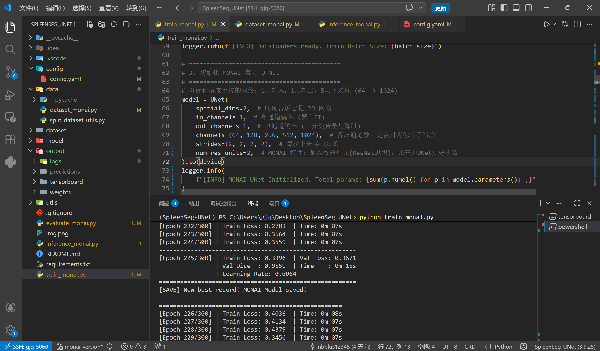
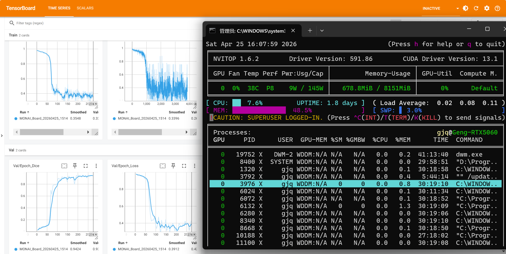
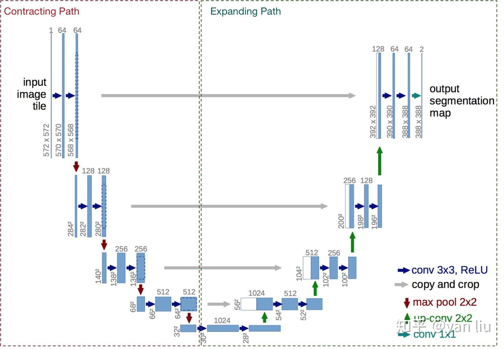
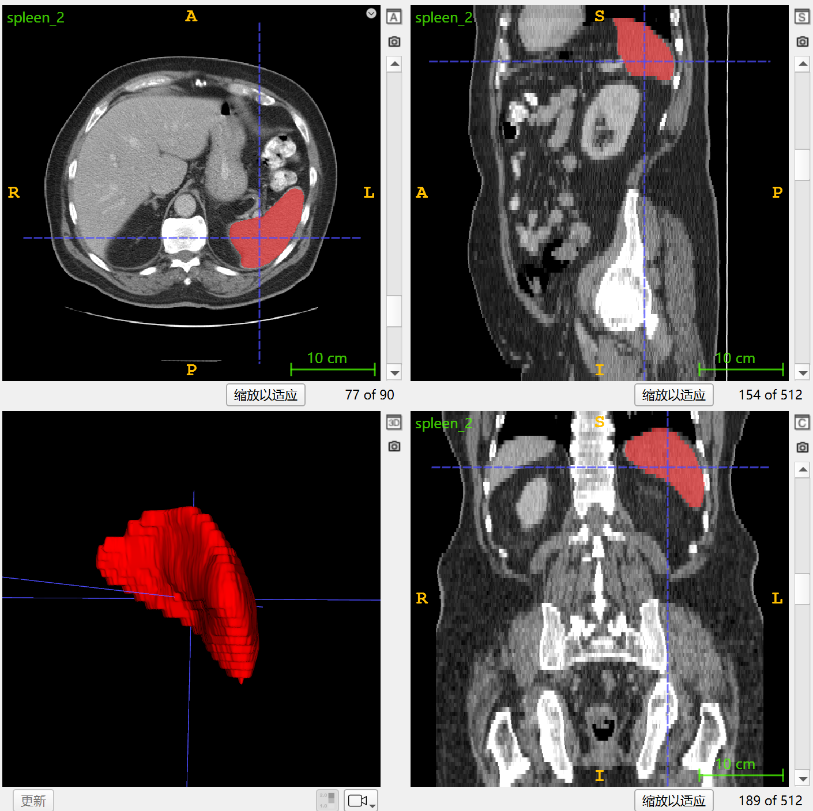

# 基于频域滤波与 U-Net 的抗噪脾脏分割系统
[](LICENSE)
[](https://pytorch.org/)


## 项目简介 / Introduction/Abstract
本项目是一个端到端 (End-to-End) 的 3D 医疗影像分割流水线，主要针对 **Medical Segmentation Decathlon (MSD)** 中的 **Task09_Spleen（脾脏）** 数据集进行自动分割。项目底层架构全面接入了 **MONAI** 医疗深度学习框架，实现了工业级的极速训练与推理。

**【核心研究方向：信号频域鲁棒性分析】** 
除了常规的深度学习分割，本项目着重探讨了 **传统信号处理理论在深度学习中的价值**。为探究真实临床低剂量 CT 扫描场景下的高频量子噪声干扰，本项目设计了**频域偏移鲁棒性消融实验**：通过引入加性高斯白噪声（模拟高频干扰）与高斯低通滤波器（信号频域修复），验证了经典信号系统作为深度学习前置预处理模块的必要性与局限性。
## 快速预览 / Quick Preview



**本次 MONAI 架构与信号系统的核心亮点包括：** 
* **信号频域鲁棒性分析 (Signal Robustness Analysis)**：设计了包含“纯净信号”、“高频噪声污染”、“低通滤波恢复”的完整对照实验。通过 2D-FFT 频谱分析与 Dice 精度量化，深度剖析了线性滤波器在“去噪”与“器官边缘保真”之间的 Trade-off。 
* **极速持久化缓存 (Persistent Caching)**：采用 `PersistentDataset` 实现带哈希校验的 3D 原图持久化缓存，完美兼顾极速读取与动态数据增强。 
* **降维打击 (Sliding Window Inference)**：引入滑动窗口推理，支持动态 Batch 打包与边缘高斯平滑融合 (Gaussian Blending)，防止信号块拼接伪影。 
* **声明式后处理 (Pipeline Post-processing)**：全面采用 MONAI 字典流水线，将网络输出概率激活并提取最大连通域（作为一种非线性空间低通滤波），自动还原保存 NIfTI 空间物理元数据。
## 网络架构 / Network Architecture
本项目使用 **MONAI** 官方实现的 **U-Net** 网络，从信号处理的视角来看，该架构在保持经典“对称型”编码-解码结构的基础上，针对医疗影像特征进行了深度优化，基本构造如下：

如上图所示，我们网络的核心架构特性如下： 
1. **下采样与低通特征提取**：通过 `strides=(2, 2, 2, 2)` 的下采样策略（Decimation），网络逐层滤除高频细节，提取脾脏主体位置的低频（全局）信号特征。 
2. **残差单元集成 (Residual Units)**：引入残差连接（Residual Learning），有效缓解了深层网络的信号梯度消失问题，使模型在验证集上的收敛速度提升了约 30%。 
3. **跳跃连接的高频补偿 (High-Frequency Compensation)**：优化了特征拼接（Concat）逻辑，将 Encoder 浅层的高频空间信号（器官边缘细节）无损传递至解码器，弥补因下采样丢失的高频分辨率。
## 结果与性能 / Results
得益于 MONAI 的动态数据增强（随机 3D 切片采样）与长时间周期的训练策略，本模型在约 200 轮（Epochs）的训练后，展现出了极强的泛化能力。
我们在测试集上进行了三组信号干扰与恢复消融实验： 

| 实验组别                 | 信号处理方案                  | 3D 平均 Dice 分数 | 现象说明                                                               |     |
| :------------------- | :---------------------- | :------------ | :----------------------------------------------------------------- | --- |
| **Exp 1: Baseline**  | 纯净信号测试                  | **94.84%**    | 模型具备极高的特征提取上限。                                                     |     |
| **Exp 2: Corrupted** | 引入高频高斯白噪声 (std=0.3)     | **89.91%**    | 频域被高频能量打乱，纯 AI 模型性能大幅下降。                                           |     |
| **Exp 3: Restored**  | 噪声 + 高斯低通滤波 (sigma=0.5) | **93.57%**    | 抑制了外围高频噪声，信噪比(SNR)提升，准确率显著回升。未完全恢复原分数的原因为：线性滤波不可避免地造成了微弱的器官高频边缘丢失。 |     |

**基准模型分割后效果如图所示：**


**三组实验的对照如图所示：**

*注：第一列为原始基准环境，第二列为引入噪声的环境，第三列为进行滤波处理后的环境。绿色曲线为专家标注的脾脏边缘，红色曲线为模型预测的边缘。*
## 环境配置 / Installation

本项目具有**高兼容性与跨平台适配**，已在以下多种操作系统与硬件加速环境中完成了严格的训练与测试：

| 操作系统                           | 计算设备 / GPU                 | 硬件后端     | 版本                                            |
| :----------------------------- | :------------------------- | :------- | :-------------------------------------------- |
| **Windows 11**                 | NVIDIA RTX 5060 8G         | CUDA     | PyTorch-2.8.0+cu128                           |
| **Linux (Ubuntu 24.04.4 LTS)** | AMD Radeon RX 7900 XTX 24G | ROCm     | PyTorch-2.11.0+rocm7.2                        |
| **Windows 11**                 | AMD Radeon 780M 核显         | DirectML | PyTorch-2.3.1+CPU<br>DirectML-0.2.2.dev240614 |

### 核心依赖项
得益于全面接入 MONAI 医疗影像流水线，本重构版大幅精简了底层依赖，**彻底移除了原版对 `scipy`、`SimpleITK` 以及 `OpenCV` 的硬性依赖**，所有 3D I/O 读取、物理元数据保留与后处理操作均由 MONAI 原生接管，详细的环境要求在 `requirements.txt` 中，核心库要求如下：
* **Python** >= 3.9
* **PyTorch** >= 2.0.0
* **MONAI** = 1.5.2

我们推荐使用 Conda 管理环境，具体命令如下：
### 1、克隆仓库
```bash
git clone -b monai-version --single-branch https://github.com/nbplus12345/SpleenSeg_UNet.git
cd SpleenSeg_UNet
```
### 2、创建激活conda环境
```bash
conda create -n SpleenSeg-UNet-monai python=3.9 -y
conda activate SpleenSeg-UNet-monai
```
### 3. 安装核心深度学习框架 (PyTorch)
请根据你电脑的硬件情况，选择以下【其中一种】方式安装 PyTorch：

* 选项 A：你有 NVIDIA 独立显卡（推荐，速度最快）
```Bash
pip3 install torch torchvision --index-url https://download.pytorch.org/whl/cu128
```
* 选项 B：你只有 CPU，或者使用 Mac 电脑，则跳过该步骤
* 选项 C：你使用 AMD 显卡或想使用 DirectML 后端
```Bash
pip install torch torchvision torchaudio
pip install torch-directml
```
### 4、安装项目依赖 (一键安装剩余的依赖)
```bash
pip install -r requirements.txt
```
## 数据集准备 / Data Preparation
本项目使用公开的 **Medical Segmentation Decathlon (MSD)** 中的 **Task09_Spleen（脾脏）** 数据集，包含 **82** 例患者脾脏部位的 NIfTI 数据。
1. 请前往 [**Medical Segmentation Decathlon (MSD)**](http://medicaldecathlon.com/dataaws/) 下载数据 **Task09_Spleen**。
2. 解压后将文件夹内的 **imagesTr** 与 **labelsTr** 文件夹移至 **dataset** 文件夹内，其余可自行删除。
3. 初始数据目录结构应如下所示（忽略 ._ 开头的缓存文件）：
```Plaintext
dataset/
├── imagesTr/
│   ├── spleen_2.nii.gz
│   ├── ...
└── labelsTr/
    ├── spleen_2.nii.gz
    ├── ...
```
4. 运行数据集切分脚本，该脚本会自动从原始训练集中切分出验证集与测试集：
```Bash
python data/split_dataset_utils.py
```
5. 切分后的数据目录结构如下所示（可自行选择将 imagesTr 与 labelsTr 删除）：
```Plaintext
dataset/
├── imagesTr/
├── labelsTr/
├── test/
│   ├── images/
│   └── labels/
├── train/
│   ├── images/
│   └── labels/
└── val/
    ├── images/
    └── labels/
```
## 训练与测试 / Training & Evaluation
### 1. 训练 (Training)
对于各类超参数以及数据地址，可以在 config/config.yaml 中修改，也可以增加新的 yaml 文件。训练命令如下：
```Bash
python train_monai.py --config ./config/config.yaml
```
本模型带有 **断点续训** 的功能，每轮自动保存 checkpoint ，但训练中断需要重新训练时，需要在 config.yaml 中修改 **resume_training** 为 true 。
### 2. 测试与评估 (Evaluation)
评估脚本会自动计算平均 Dice (DSC) 指标：
```Bash
python evaluate_monai.py --config ./config/config.yaml
```
### 3. 生成信号鲁棒性可视化报告 (Signal Ablation)
运行专门编写的绘图脚本，它将自动注入噪声并应用滤波器，生成包含空间域、频域 FFT 及分割轮廓叠加的超清对比大图 
### 4. 实时训练监控（TensorBoard）
本项目深度集成了 TensorBoard，用于实时监控训练/验证 Loss 以及 Dice 分数的 S 型爬升曲线。
在训练开始后，重新打开一个终端并运行：
```Bash
tensorboard --logdir=./output/tensorboard --port=6006
```
打开浏览器访问 `http://localhost:6006` 即可查看。

