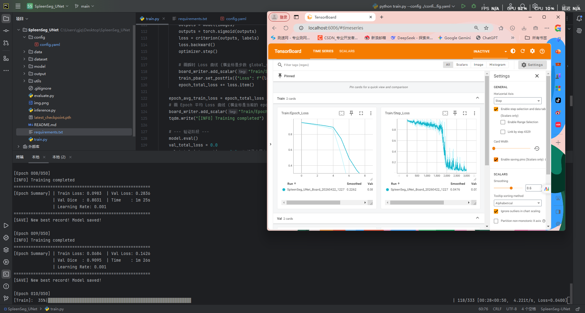
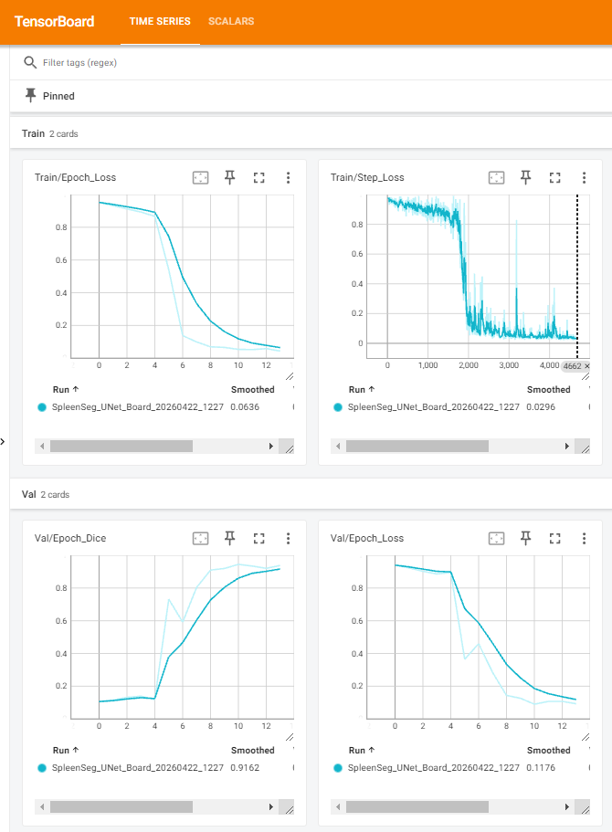
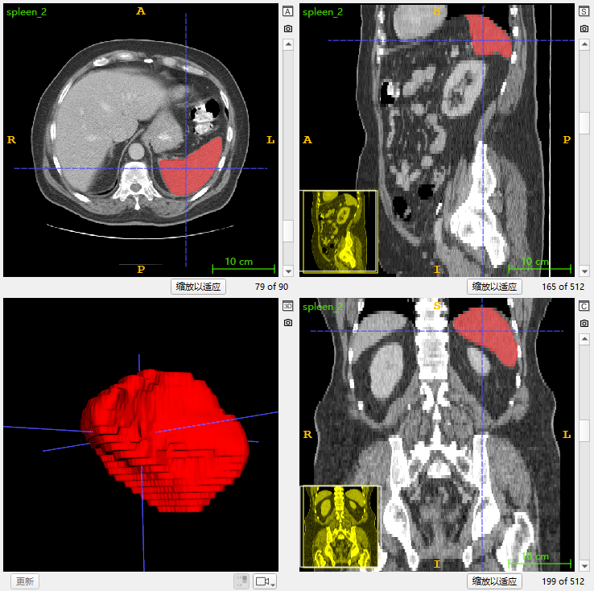

# Spleen Segmentation Based on 2D U-Net
[English](./README.md) | [简体中文](./README_zh-CN.md)

[](LICENSE)
[](https://pytorch.org/)

## Project Overview / Introduction
This project is a spleen segmentation model based on **2D U-Net**, designed primarily to automatically segment images from the **Task09_Spleen** dataset of the **Medical Segmentation Decathlon (MSD)**. I created this project to learn how to construct and use a **2D U-Net** network.

I later wrote a fairly comprehensive retrospective on the project. It mainly documents my learning journey through the 2D U-Net spleen CT segmentation project, including NIfTI data processing, case-level data splitting, window width and window level normalization, slicing 3D volumes into 2D slices, blank-slice handling, the U-Net architecture, DiceLoss, reconstructing 2D predictions into 3D masks during inference, and a comparison between the MONAI refactored and handwritten workflows.

Blog: [From Cat-and-Dog Classification to Medical Image Segmentation: A Retrospective on 2D U-Net Spleen CT Segmentation](https://blog.csdn.net/weixin_53384391/article/details/161930030)

## Quick Preview / Quick Preview


## Network Architecture / Network Architecture
This project uses the classic **U-Net** network, whose basic structure is shown below.

As shown above, the network consists mainly of the following core components: 
1. **[Double Convolution Block (DoubleConv)]**: Two consecutive `Conv2d -> BatchNorm2d -> ReLU` stacks. Batch Normalization significantly mitigates internal covariate shift.
2. **[Fully Convolutional Encoder (Encoder)]**: Uses a four-stage downsampling structure. Double convolution gradually expands the number of feature channels from 64 to 1024 at the bottom of the network.
3. **[Skip Connections]**: Bridges matching levels of the U-shaped architecture, directly passing and concatenating shallow feature maps from the encoder with the corresponding feature maps in the decoder.
4. **[Upsampling Decoder (Decoder)]**: Uses transposed convolution (ConvTranspose2d) as the upsampling operator, doubling the spatial resolution of deep semantic feature maps and halving the number of channels at each stage. After merging the fine-grained features delivered by the skip connections, convolutional layers decode the features. Finally, a $1 \times 1$ convolution reduces the number of channels to the number of classes (one channel) and outputs a probability map for the 2D spleen segmentation mask.
## Results and Performance / Results
After 11 epochs of training, the model achieved a **94.44%** Dice score on the validation set and a **94.74%** Dice score on the test set. See the training and evaluation logs in **logs/** for details.

**The segmentation result is shown below:**

## Environment Setup / Installation

This project offers **high compatibility and cross-platform support**. It has been thoroughly trained and tested on the following operating systems and hardware acceleration environments:

| Operating System | Compute Device / GPU | Hardware Backend | Version |
| :----------------------------- | :------------------------- | :------- | :-------------------------------------------- |
| **Windows 11**                 | NVIDIA RTX 5060 8G         | CUDA     | PyTorch-2.8.0+cu128                           |
| **Linux (Ubuntu 24.04.4 LTS)** | AMD Radeon RX 7900 XTX 24G | ROCm     | PyTorch-2.11.0+rocm7.2                        |
| **Windows 11**                 | AMD Radeon 780M integrated GPU | DirectML | PyTorch-2.3.1+CPU<br>DirectML-0.2.2.dev240614 |

### Core Dependencies
Detailed environment requirements are provided in `requirements.txt`. The core library requirements are:
* **Python** >= 3.9
* **PyTorch** >= 2.0.0
* **Medical image processing libraries**: SimpleITK, Nibabel

We recommend using Conda to manage the environment. The commands are as follows:
### 1. Clone the Repository
```bash
git clone -b main --single-branch https://github.com/nbplus12345/SpleenSeg_UNet.git
cd SpleenSeg_UNet
```
### 2. Create and Activate the Conda Environment
```bash
conda create -n SpleenSeg-UNet python=3.9 -y
conda activate SpleenSeg-UNet
```
### 3. Install the Core Deep Learning Framework (PyTorch)
Choose **one** of the following PyTorch installation methods based on your computer hardware:

* Option A: You have a dedicated NVIDIA GPU (recommended and fastest)
```Bash
pip3 install torch torchvision --index-url https://download.pytorch.org/whl/cu128
```
* Option B: You only have a CPU or use a Mac; skip this step
* Option C: You use an AMD GPU or want to use the DirectML backend
```Bash
pip install torch torchvision torchaudio
pip install torch-directml
```
### 4. Install Project Dependencies (install all remaining dependencies at once)
```bash
pip install -r requirements.txt
```
## Data Preparation / Data Preparation
This project uses the public **Task09_Spleen** dataset from the **Medical Segmentation Decathlon (MSD)**, containing NIfTI data from **41** patients.
1. Visit [**Medical Segmentation Decathlon (MSD)**](http://medicaldecathlon.com/dataaws/) and download **Task09_Spleen**.
2. After extraction, move the **imagesTr** and **labelsTr** folders into the **dataset** folder. The remaining files may be deleted.
3. The initial data directory should have the following structure (ignore cache files beginning with ._):
```Plaintext
dataset/
├── imagesTr/
│   ├── spleen_2.nii.gz
│   ├── ...
└── labelsTr/
    ├── spleen_2.nii.gz
    ├── ...
```
4. Run the dataset splitting script, which automatically creates validation and test sets from the original training set:
```Bash
python data/split_dataset_utils.py
```
5. The split data directory has the following structure (you may delete imagesTr and labelsTr if desired):
```Plaintext
dataset/
├── imagesTr/
├── labelsTr/
├── test/
│   ├── images/
│   └── labels/
├── train/
│   ├── images/
│   └── labels/
└── val/
    ├── images/
    └── labels/
```
6. Because this project uses a 2D U-Net, the 3D `.nii.gz` data must first be sliced along the Z-axis into 2D `.npy` arrays, normalized using CT window width and window level, and filtered to remove invalid blank background slices. Run the following preprocessing script:
```Bash
python data/data_preprocess_utils.py
```
## Training and Testing / Training & Evaluation
### 1. Training (Training)
Hyperparameters and data paths can be modified in config/config.yaml, and additional YAML files may also be added. Run training with:
```Bash
python train.py --config ./config/config.yaml
```
- This model supports **resuming interrupted training** and automatically saves a checkpoint after every epoch. To resume after an interruption, set **resume_training** to true in config.yaml.
- This project also integrates **TensorBoard** for real-time visualization. During training, you can monitor the Loss curve and changes in the validation Dice coefficient at any time. Open a new terminal, activate the virtual environment, and run the following command to launch the dashboard:
```bash
tensorboard --logdir=output/tensorboard --reload_interval=30
```
*After the command starts successfully, visit `http://localhost:6006/` in a browser to open the visualization dashboard.*
### 2. Testing and Evaluation (Evaluation)
The evaluation script automatically calculates the mean Dice (DSC):
```Bash
python evaluate.py --config ./config/config.yaml
```
### 3. View Segmentation Results (Segmentation)
Configure the input CT path and output path in config/config.yaml, then run the segmentation script:
```Bash
python inference.py --config ./config/config.yaml
```
### 4. Real-Time Training Monitoring (TensorBoard)
This project deeply integrates TensorBoard to monitor training/validation Loss and the S-shaped rise of the Dice score in real time.
After training begins, open another terminal and run:
```Bash
tensorboard --logdir=./output/tensorboard --port=6006
```
Open `http://localhost:6006` in a browser to view it.

## License

This project is open-sourced under the MIT License and may be freely used, modified, and distributed. See the [LICENSE](./LICENSE) file for details.
