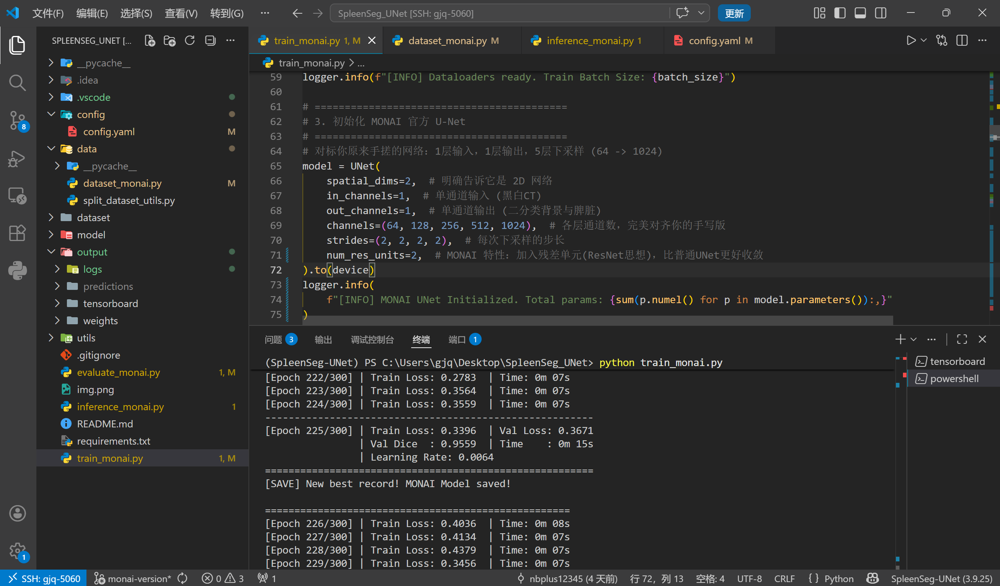
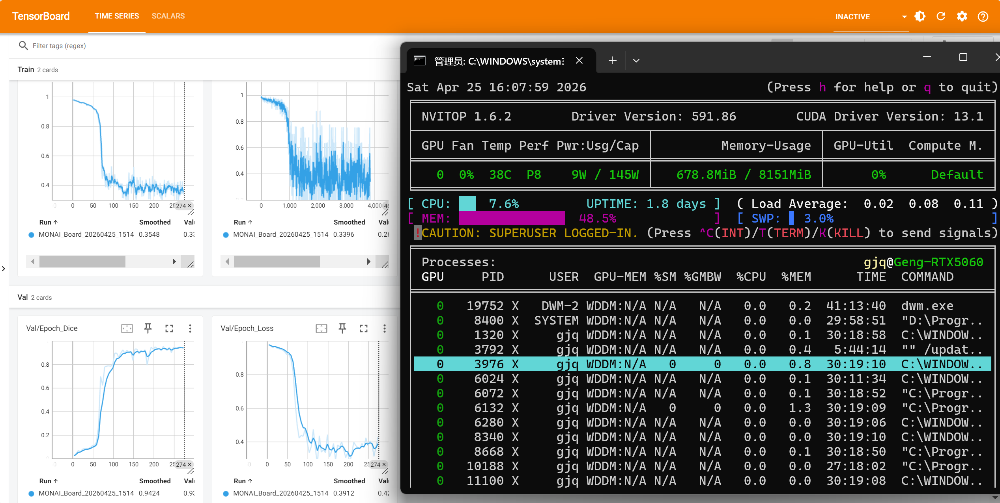
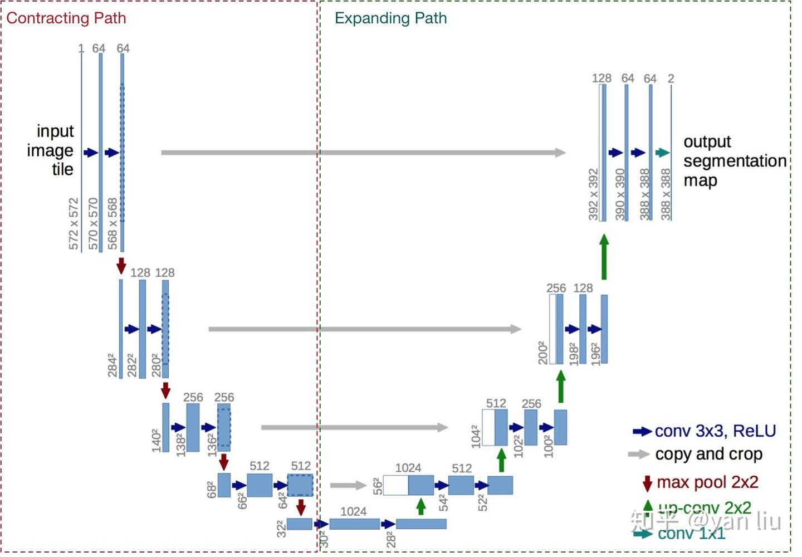
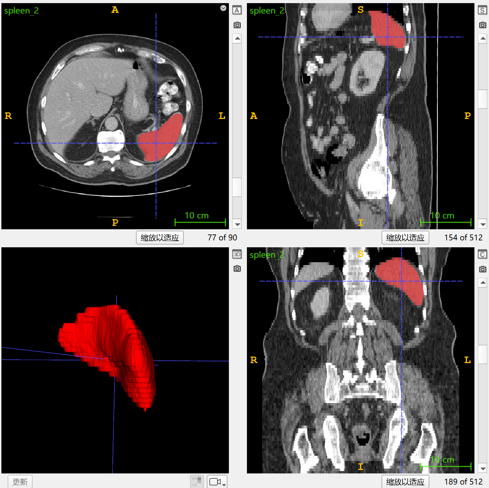

# Noise-Robust Spleen Segmentation with Frequency-Domain Filtering and U-Net
[English](./README.md) | [简体中文](./README_zh-CN.md)

[](LICENSE)
[](https://pytorch.org/)


## Project Overview / Introduction
This project is an end-to-end 3D medical image segmentation pipeline designed primarily to automatically segment the **Task09_Spleen** dataset from the **Medical Segmentation Decathlon (MSD)**. The underlying architecture fully adopts the **MONAI** medical deep learning framework, enabling production-grade high-speed training and inference.

**[Core Research Direction: Signal Frequency-Domain Robustness Analysis]** 
Beyond conventional deep learning segmentation, this project focuses on the **value of traditional signal processing theory in deep learning**. To investigate high-frequency quantum noise in realistic clinical low-dose CT scans, the project designs a **frequency-domain shift robustness ablation study**. By introducing additive white Gaussian noise (simulating high-frequency interference) and a Gaussian low-pass filter (frequency-domain signal restoration), it evaluates the necessity and limitations of classic signal systems as preprocessing modules for deep learning.
## Quick Preview / Quick Preview



**Core highlights of the MONAI architecture and signal processing system include:** 
* **Signal Frequency-Domain Robustness Analysis (Signal Robustness Analysis)**: Designs a complete controlled experiment covering clean signals, high-frequency noise corruption, and low-pass filtering recovery. 2D FFT spectrum analysis and quantitative Dice accuracy reveal the trade-off of linear filters between denoising and preserving organ boundaries. 
* **High-Speed Persistent Caching (Persistent Caching)**: Uses `PersistentDataset` to persistently cache hash-verified original 3D images, combining fast reads with dynamic data augmentation. 
* **Streamlined Sliding Window Inference**: Introduces sliding-window inference with dynamic batch packing and Gaussian blending at the edges to prevent block-stitching artifacts. 
* **Declarative Pipeline Post-processing**: Uses a MONAI dictionary pipeline throughout to activate network output probabilities, extract the largest connected component (a form of nonlinear spatial low-pass filtering), and automatically restore and save NIfTI spatial metadata.
## Network Architecture / Network Architecture
This project uses MONAI's official **U-Net** implementation. From a signal-processing perspective, the architecture retains the classic symmetric encoder-decoder structure while being deeply optimized for medical imaging features. Its basic structure is shown below:

As shown above, the network has the following core architectural features: 
1. **Downsampling and Low-Pass Feature Extraction**: With the `strides=(2, 2, 2, 2)` downsampling strategy (decimation), the network progressively filters high-frequency detail and extracts low-frequency (global) signal features representing the primary spleen location. 
2. **Residual Unit Integration (Residual Units)**: Residual connections effectively mitigate signal-gradient vanishing in deep networks and improve convergence speed on the validation set by approximately 30%. 
3. **High-Frequency Compensation through Skip Connections (High-Frequency Compensation)**: Optimized feature concatenation passes high-frequency spatial signals from shallow encoder layers (organ boundary details) to the decoder without loss, compensating for high-frequency resolution lost during downsampling.
## Results and Performance / Results
Thanks to MONAI's dynamic data augmentation (random 3D patch sampling) and long training schedule, the model demonstrates strong generalization after approximately 200 epochs.
Three signal corruption and restoration ablation experiments were conducted on the test set: 

| Experiment Group | Signal Processing Method | Mean 3D Dice Score | Observation |
| :------------------- | :---------------------- | :------------ | :----------------------------------------------------------------- |
| **Exp 1: Baseline**  | Clean signal test | **94.84%** | The model has a very high upper bound for feature extraction. |
| **Exp 2: Corrupted** | High-frequency Gaussian white noise (std=0.3) | **89.91%** | High-frequency energy disrupts the spectrum, causing a substantial performance drop in the pure AI model. |
| **Exp 3: Restored**  | Noise + Gaussian low-pass filtering (sigma=0.5) | **93.57%** | Suppressing peripheral high-frequency noise improves the signal-to-noise ratio (SNR) and significantly restores accuracy. Full recovery is prevented by the slight loss of high-frequency organ boundaries that is unavoidable with linear filtering. |

**The baseline model's segmentation result is shown below:**


**A comparison of the three experiments is shown below:**

*Note: The first column shows the original baseline environment, the second shows the noisy environment, and the third shows the filtered environment. The green curve is the expert-annotated spleen boundary, and the red curve is the model-predicted boundary.*
## Environment Setup / Installation

This project offers **high compatibility and cross-platform support**. It has been thoroughly trained and tested on the following operating systems and hardware acceleration environments:

| Operating System | Compute Device / GPU | Hardware Backend | Version |
| :----------------------------- | :------------------------- | :------- | :-------------------------------------------- |
| **Windows 11**                 | NVIDIA RTX 5060 8G         | CUDA     | PyTorch-2.8.0+cu128                           |
| **Linux (Ubuntu 24.04.4 LTS)** | AMD Radeon RX 7900 XTX 24G | ROCm     | PyTorch-2.11.0+rocm7.2                        |
| **Windows 11**                 | AMD Radeon 780M integrated GPU | DirectML | PyTorch-2.3.1+CPU<br>DirectML-0.2.2.dev240614 |

### Core Dependencies
By fully adopting the MONAI medical imaging pipeline, this refactored version greatly simplifies the underlying dependencies and **completely removes the original hard dependencies on `scipy`, `SimpleITK`, and `OpenCV`**. MONAI now handles all 3D I/O, preservation of physical metadata, and post-processing natively. Detailed environment requirements are provided in `requirements.txt`; the core requirements are:
* **Python** >= 3.9
* **PyTorch** >= 2.0.0
* **MONAI** = 1.5.2

We recommend using Conda to manage the environment. The commands are as follows:
### 1. Clone the Repository
```bash
git clone -b monai-version --single-branch https://github.com/nbplus12345/SpleenSeg_UNet.git
cd SpleenSeg_UNet
```
### 2. Create and Activate the Conda Environment
```bash
conda create -n SpleenSeg-UNet-monai python=3.9 -y
conda activate SpleenSeg-UNet-monai
```
### 3. Install the Core Deep Learning Framework (PyTorch)
Choose **one** of the following PyTorch installation methods based on your computer hardware:

* Option A: You have a dedicated NVIDIA GPU (recommended and fastest)
```Bash
pip3 install torch torchvision --index-url https://download.pytorch.org/whl/cu128
```
* Option B: You only have a CPU or use a Mac; skip this step
* Option C: You use an AMD GPU or want to use the DirectML backend
```Bash
pip install torch torchvision torchaudio
pip install torch-directml
```
### 4. Install Project Dependencies (install all remaining dependencies at once)
```bash
pip install -r requirements.txt
```
## Data Preparation / Data Preparation
This project uses the public **Task09_Spleen** dataset from the **Medical Segmentation Decathlon (MSD)**, containing NIfTI data from **41** patients.
1. Visit [**Medical Segmentation Decathlon (MSD)**](http://medicaldecathlon.com/dataaws/) and download **Task09_Spleen**.
2. After extraction, move the **imagesTr** and **labelsTr** folders into the **dataset** folder. The remaining files may be deleted.
3. The initial data directory should have the following structure (ignore cache files beginning with ._):
```Plaintext
dataset/
├── imagesTr/
│   ├── spleen_2.nii.gz
│   ├── ...
└── labelsTr/
    ├── spleen_2.nii.gz
    ├── ...
```
4. Run the dataset splitting script, which automatically creates validation and test sets from the original training set:
```Bash
python data/split_dataset_utils.py
```
5. The split data directory has the following structure (you may delete imagesTr and labelsTr if desired):
```Plaintext
dataset/
├── imagesTr/
├── labelsTr/
├── test/
│   ├── images/
│   └── labels/
├── train/
│   ├── images/
│   └── labels/
└── val/
    ├── images/
    └── labels/
```
## Training and Testing / Training & Evaluation
### 1. Training (Training)
Hyperparameters and data paths can be modified in config/config.yaml, and additional YAML files may also be added. Run training with:
```Bash
python train_monai.py --config ./config/config.yaml
```
This model supports **resuming interrupted training** and automatically saves a checkpoint after every epoch. To resume after an interruption, set **resume_training** to true in config.yaml.
### 2. Testing and Evaluation (Evaluation)
The evaluation script automatically calculates the mean Dice (DSC):
```Bash
python evaluate_monai.py --config ./config/config.yaml
```
### 3. Generate the Signal Robustness Visualization Report (Signal Ablation)
Run the dedicated plotting script. It automatically injects noise and applies filters, generating a high-resolution comparison figure containing the spatial domain, frequency-domain FFT, and segmentation contour overlays:
```Bash
python visualize_signal_results.py
```
### 4. Real-Time Training Monitoring (TensorBoard)
This project deeply integrates TensorBoard to monitor training/validation Loss and the S-shaped rise of the Dice score in real time.
After training begins, open another terminal and run:
```Bash
tensorboard --logdir=./output/tensorboard --port=6006
```
Open `http://localhost:6006` in a browser to view it.
